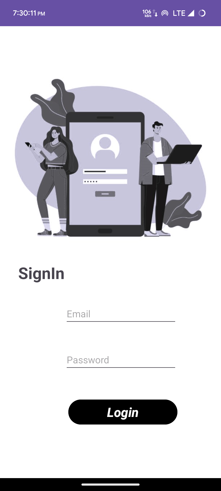
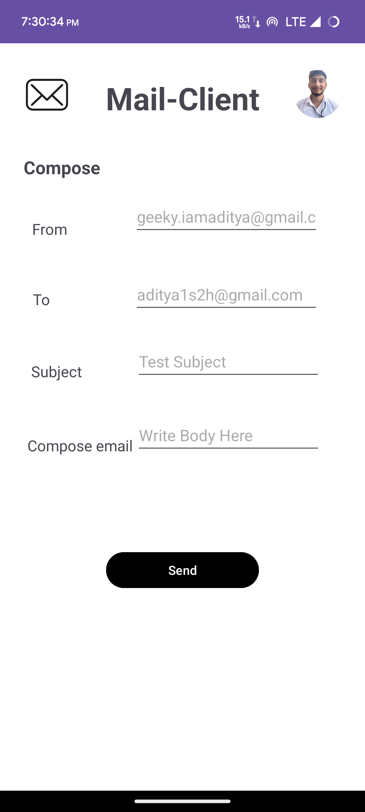

# 📧 Email Client Android App using JavaMail API and Android Studio

This is an Android application developed using Java and Android Studio that allows users to send emails from their Gmail accounts. It uses the JavaMail API to send emails through the SMTP server.

## Prerequisites
1. ⚙️ Java Development Kit (JDK)
2. 📱 Android Studio
3. 📧 Gmail account

## Getting Started
1. 🔀 Clone the repository:
```
git clone https://github.com/iamaditya/Email-Client-Android-Application.git
```

2. 📂 Open the project in Android Studio.
3. 🚀 Update the Gmail account credentials:
   - Open the `MainActivity.java` file.
   - Replace `your-username` with your Gmail username in the `sendMail` method.
   - Replace `your-password` with your Gmail password in the `sendMail` method.

4. ▶️ Build and run the application on an Android device or emulator.

## Usage
1. 🔛 Launch the application on your Android device.
2. ✉️ Enter the email address of the recipient in the "To" field.
3. 📩 Enter your Gmail address in the "From" field.
4. 📜 Enter the subject and body of the email in the respective fields.
5. 💌 Tap the "Send" button to send the email.

## Screenshots
<div style="text-align: center;">
  

  

</div>


## Contributing
🤝 Contributions are welcome! If you find any issues or want to enhance the functionality, feel free to submit a pull request.

## License
This project is licensed under the [MIT License](LICENSE).

## Acknowledgements
- [JavaMail API](https://javaee.github.io/javamail/)